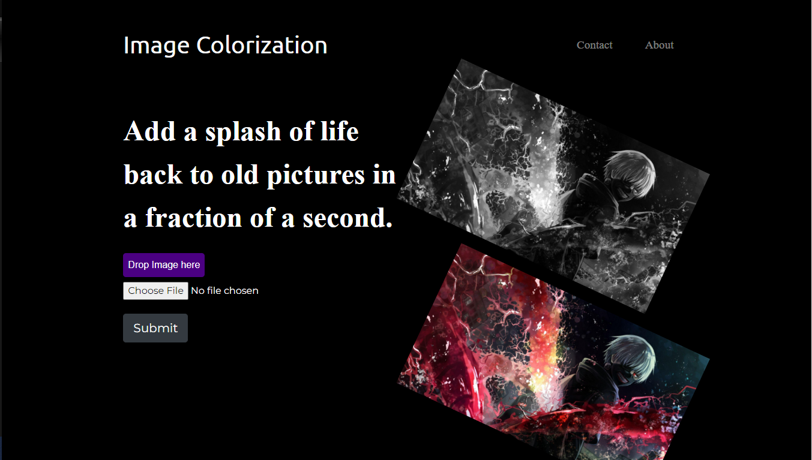
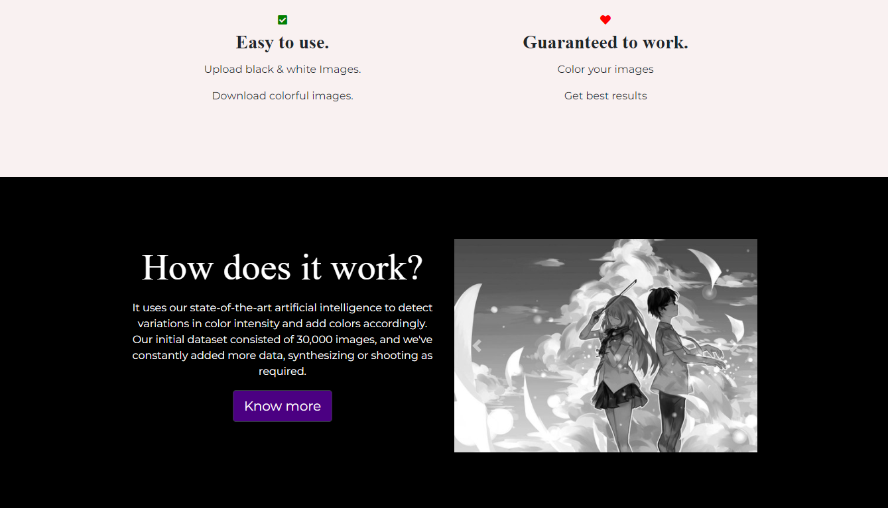
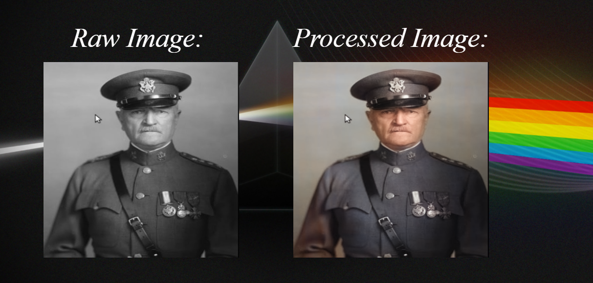

# Colorising Black and White Image using Deep Learning and Deploying using django as backend

Image Upscaler with Web End Deployment using Django
# [Image Colorisation-with-Web-End-Deployment](https://imagecolorisation.herokuapp.com/)
## [Checkout Live Model Api at ](https://imagecolorisation.herokuapp.com/):[https://imagecolorisation.herokuapp.com/](https://imagecolorisation.herokuapp.com/)
```
[https://imageupscaler.herokuapp.com/]
```
[Deployed Model](https://imagecolorisation.herokuapp.com/)

To run Server on Local machine for image Upscaling
`python manage.py runserver`

 # UI
 
 
 

# For Training Model

- Fork the Main Repo Of [Image Colorisation](https://github.com/vaibhavhariaramani/Image-Colorisation-Algorithms) .
- In that Repo open `ApproachByRzang_ECCV16`.
- Either use ipynb on various dataset or 
- To train the model with a zoom factor of 2, for 200 epochs and on GPU:

`python execute.py`

At each epoch, a `.pth` model file will be saved.

To use the model on an image: (the zoom factor must be the same the one used to train the model)

`python runner.py`
# Example

Original image:

<!--  -->


ECCV16 approach:

<!--  -->

Rzang Approach:

<!--  -->

## Deploying ML model on HEROKU
1. Sign up or Login to [HEROKU](https://www.heroku.com/)
2. Go to [heroku dashboard](https://dashboard.heroku.com/apps)
3. Click on create on new apps
4. Give a name to your model app such as 'Linear-Regression'
5. Connect app with your ML model Github Repo
6. Click on deploy model
Hence your model is deployed.....
Checkout my model [https://imageupscaler.herokuapp.com/](https://imageupscaler.herokuapp.com/)
============================================================================ 


# Resources 

To learn more about these Resources you can Refer to some of these articles written by Vaibhav Hariramani:-

- [Medium](https://medium.com/geeky-bawa)
- [geeky Traveller](https://sites.google.com/view/geeky-traveller/)
- [Blogs](https://github.com/vaibhavhariaramani/blogs)
- [Youtube](https://www.youtube.com/channel/UCy7amUpLnsRLEMIaJGGBYog)[](https://www.youtube.com/channel/UCy7amUpLnsRLEMIaJGGBYog)

### Don't forget to tag us

if you use this repo in  your project don't forget to mention us as Contributer in it . And Don't forget to tag us [Linkedin](https://www.linkedin.com/in/vaibhav-hariramani-087488186/),[ instagram](https://www.instagram.com/geeky_baba_/?hl=en),[ facebook](https://www.facebook.com/jayesh.hariramani.3) ,[ twitter](https://www.linkedin.com/in/vaibhav-hariramani-087488186/), [ Github](https://github.com/vaibhavhariaramani) 

============================================================================
## Team Members
### Ayush Mudgal
### Kshitij Murabatte
### Saksham Sharma
### Vaibhav Hariramani
### Shivanth

The innovative team consisting of Ayush Mudgal, Kshitij Murabatte, Saksham Sharma, Vaibhav Hariramani, and Shivanth has made remarkable strides in the realm of image transformation using deep learning techniques. Their groundbreaking project involved the development of a cutting-edge system capable of colorizing black and white images through the power of artificial intelligence. Leveraging the capabilities of deep learning algorithms, the team successfully trained a model to recognize and predict appropriate colors for grayscale images, effectively breathing life into historical and monochromatic photographs.

To bring their visionary project to life, the team decided to implement a robust and user-friendly deployment strategy. They turned to the Django framework to serve as the backend of their application. By seamlessly integrating Django's web development capabilities, the team ensured a smooth and interactive user experience. This backend not only facilitated the interaction between the user interface and the deep learning model but also allowed for efficient storage, retrieval, and management of images and their corresponding colorizations.

The synergy between Ayush, Kshitij, Saksham, Vaibhav, and Shivanth was a key factor in the success of this endeavor. Each member brought their unique skill set to the table, from expertise in deep learning architectures to frontend and backend development prowess. The team's dedication, collaboration, and passion for pushing the boundaries of technology resulted in a remarkable project that showcases the harmonious blend of AI innovation and web development ingenuity. As a result, they not only breathed new life into black and white memories but also set a prime example of how interdisciplinary collaboration can lead to groundbreaking achievements.

[Vaibhav H PortFolio](https://vaibhavhariaramani.github.io/)
You can find me at:-
[Linkedin](https://www.linkedin.com/in/vaibhav-hariramani-087488186/) or [Github](https://github.com/vaibhavhariaramani) .

Email: [vaibhav.hariramani01@gmail.com](mailto:vaibhav.hariramani01@gmail.com)


# Download [THE VAIBHAV HARIRAMANI APP](https://play.google.com/store/apps/details?id=com.geeky.developer)

# [](https://play.google.com/store/apps/details?id=com.geeky.developer) 
<p align='center'>
<a href="https://www.linkedin.com/in/vaibhav-hariramani-087488186/"></a>&nbsp;&nbsp;
<a href="https://twitter.com/vaibhavhariram2"></a>&nbsp;&nbsp;
<a href="https://www.instagram.com/vaibhav.hariramani/?hl=en"></a>&nbsp;&nbsp;
<a href="https://www.buymeacoffee.com/vaibhavJii"></a>
<a href="https://wa.me/+917790991077"></a>&nbsp;&nbsp;
<a href="mailto:vaibhav.hariramani01@gmail.com"></a>&nbsp;&nbsp;
</p>


[The Vaibhav Hariramani App (Latest Version) ](https://play.google.com/store/apps/details?id=com.geeky.developer)

Download [THE VAIBHAV HARIRAMANI APP](https://play.google.com/store/apps/details?id=com.geeky.developer) consist of Tutorials,Projects,Blogs and Vlogs of our Site developed Using Android Studio with Web View try installing it in your android device.

Happy coding ❤️ .
